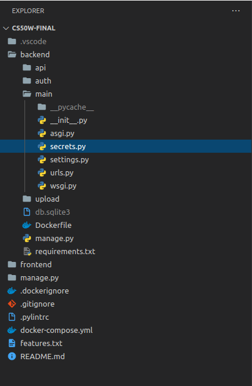

# Photo Management Interface

Welcome to my [final assignment](https://cs50.harvard.edu/web/2020/projects/final/capstone/) for **[Harvard's CS50W - Web Development with Python and JavaScript](https://courses.edx.org/courses/course-v1:HarvardX+CS50W+Web/course/)**

In the following paragraphs I want to outline what I did and, where applicable, why I did it.

It was my goal to build something I was proud of, that looked nice, worked well, but also added utility to my own life. I took this opportunity to experiment with ReactJS because I wanted to try out the latest and greatest in web development, learn new skills and as I said, actually build something useful.

As a photographer I always relied on services built by others to assemble and publish my online portfolio's. This time however I wanted to design everything myself from scratch!

In essence, this application is the admin panel for a portfolio website I want to build in the coming months. As photographer I wanted to have an application where I can upload, rate and select the images that I will show to my clients later on: **My Favs!**

So, while they will only see a carefully curated selection in the end, I will be working behind the scenes in this app to like, rate and delete images, making sure I can build a dynamic selection by either uploading images from this app or dragging and dropping them in the cloud storage provider for images (Cloudinary), then fetching them to display in my admin panel and later the portfolio frontend.

Have fun liking, rating and deleting!
For questions and inquiries please feel free to contact me at: florestankorp@gmail.com

<3

Florestan Korp,
November 2020

# Design

## Local development


## Why Docker?

Docker helped me keep my local machine clean of, not having to pollute it with configs and different runtime environments. Being able to share my project with my mentor and show it to colleagues during development was also a big plus. Docker is a nice and simple way to get up and running quickly on any machine while not having to deal with the hassle of installing Python virtual environments or having to upgrade your NodeJS version in order for you to run this app, so essentially it lowered the barrier for working with different runtime environments, sharing my idea and getting feedback quickly.

## Why ReactJS?

As one of the leading use-cases and implementations of JavaScript today this framework is very popular and a valuable addition to my toolkit as a web developer. It will considerably improve my position on the job market, and, although it added a steep learning curve to my project, I felt this was also a sound architectural decision because it leaves me with an app that is far easier to maintain and offers room for expanding in the future, that I thought it worth the extra time I'd have to invest.

## Why Django Rest Framework (DRF)?

As the view part of my application and templates would be handled solely by the ReactJS frontend (separation of concerns) I was looking for a way to disable all the features of Django I would not be needing such as the Jinja2 templates and views, which lead me to discover DRF, which is a lightweight alternative that would let me use all the things I had learned about in [this course](https://courses.edx.org/courses/course-v1:HarvardX+CS50W+Web/course/), while having a much smaller memory footprint than the full fledged Django framework.

## Why Cloudinary?

I opted for a third party storage platform because that seemed like the most robust and safe option in the long run. So, instead of having to deal with the overhead of learning how to store and optimize for image retrieval in Django, plus having to have my own storage, I decided to 'outsource' that task to Cloudinary. They have excellent documentation and a very versatile SDK that binds very well with the Django framework.

# Signing up to Cloudinary

This app requires you to have a Cloudinary account. If you don't already have one go ahead and [register here](https://cloudinary.com/users/register/free) then add the secrets to the secrets file (see below). Because their API uses Basic Authentication over secure HTTP they require your Cloudinary API Key and API Secret (which can be found on the Dashboard page of your Cloudinary console).

**Note**: Always be careful who you share your credentials with and make sure to keep your API keys and secrets out of version control!

## Secret

Create a file called **secrets.py** in `./backend/main` and add the following values:

```
CLOUD_NAME = "your Cloudinary cloud name"
API_KEY = "your Cloudinary api key"
API_SECRET = "your Cloudinary api secret"

# it is also advised to keep your Django secret key in this file and add it to .gitignore
SECRET_KEY = "your Django secret key"
```



# Running the dev servers

Requirements:

- [Docker](https://docs.docker.com/engine/install/)
- [Docker Compose](https://docs.docker.com/compose/install/)

## ...with docker-compose

`docker-compose` uses the Dockerfiles in the respective folders for frontend and backend. From the root of the project run:

`$ docker-compose run`

The app is now running on `http://localhost:3001/`

## ...with docker-run

**Frontend**

In the root of the project run:

```
$ cd frontend
$ docker build -t frontend:dev .
$ docker run -it --rm -v ${PWD}:/frontend -v /frontend/node_modules -p 3001:3000 -e CHOKIDAR_USEPOLLING=true frontend:dev
```

> If you run into an "ENOENT: no such file or directory, open '/frontend/package.json". error, you may need to add an additional volume: -v /frontend/package.json.

**Backend**

Then, again from the root of the project run:

```
$ cd backend
$ docker build -t backend:dev .
$ docker run -it --rm -v ${PWD}:/backend -p 8001:8000 backend:dev
```

**What’s happening here?**

1. The [docker run](https://docs.docker.com/engine/reference/commandline/run/) command creates and runs a new container instance from the image we just created.
2. `-it` starts the container in [interactive mode](https://stackoverflow.com/questions/48368411/what-is-docker-run-it-flag). Why is this necessary? As of version 3.4.1, `react-scripts` exits after start-up (unless CI mode is specified) which will cause the container to exit. Thus the need for interactive mode.
3. `--rm` [removes](https://docs.docker.com/engine/reference/run/#clean-up---rm) the container and volumes after the container exits.
4. `-v ${PWD}:/app` mounts the code into the container at “/app”.

> {PWD} may not work on Windows. See this Stack Overflow question for more info.

5. Since we want to use the container version of the “node_modules” folder, we configured another volume: `-v /app/node_modules`. You should now be able to remove the local “node_modules” flavor.
6. `-p 3001:3000` exposes port 3000 to other Docker containers on the same network (for inter-container communication) and port 3001 to the host.

For more, review [this](https://stackoverflow.com/questions/22111060/what-is-the-difference-between-expose-and-publish-in-docker) Stack Overflow question.

Finally, -e CHOKIDAR_USEPOLLING=true enables a polling mechanism via chokidar (which wraps fs.watch, fs.watchFile, and fsevents) so that hot-reloading will work.
Open your browser to `http://localhost:3001/` and you should see the app. Try making a change to the App component within your code editor. You should see the app hot-reload. Kill the server once done.

# Features and usage

1. Register user
2. Log in / log out
3. Upload images through ReactJS frontend
4. Upload images through Cloudinary interface
5. Like / un-like images
6. View favs
7. Delete images

# Validations and error handling

## Frontend

Validation takes place in the `Register.tsx` component.

**Username (email)**:
See **EMAIL_REGEX** in `./frontend/src/shared/constants.ts`

**Password**: Password has to be at least 8 characters long
**No image selected for upload**: Error thrown prompting to chose a file
**No images in cloud storage**: Frontend error prompting user to upload images
**No images in Favs**: Frontend message prompting user to like images

## Backend

**API call pending state**: Triggers a spinner in the FE for uploading images, toggle likes, deleting and auth calls
**Server offline**: Triggers Error component to be shown on every page in the frontend with the error message
**Resource not found (404)**: Triggers Error component to be shown on every page in the frontend with the error message
**Rate limit exceeded (400)**:Triggers Error component to be shown on every page in the frontend with the error message
**Unauthorized (400)**:Triggers Error component to be shown on login page in the frontend with the error message

# Dependencies

## Backend

**Django REST framework**: A Python based, lightweight yet powerful and flexible toolkit for building Web API's using only the core features of Django. I chose this because I decided to separate the view from my API layer into a separate frontend.
**Cloudinary (SDK)**: Cloud-based image and video management services. It enables users to upload, store, manage, manipulate, and deliver images and video
**Django-Rest-Knox**: Provides easy to use authentication allowing for common patterns
**Django-CORS-Headers**: Required for allowing requests to the Django application from other origins

## Frontend

**React**: JavaScript framework for building single page applications
**ReduxJS-Toolkit**: State management tool and abstraction layer on top of redux pattern
**Typescript**: Language based on JavaScript (superset) providing type safety and type checking
**ES-Lint**: Syntax and code style checking; identifying and reporting JavaScript patterns
**Prettier**: Code formatter
**Bulma**: CSS framework based on flexbox and built with Sass
**Fontawesome**: Icon library

The combination of these tools helps me to catch errors while writing my code and without even leaving my IDE. They also help me deliver semantic, readable and well-formatted code that is maintainable.

As for the styling dependencies I was curious and excited to work with something new, so I decided to go with Bulma over Bootstrap. This helped with giving the application a modern look and feel while maintaining a focus on responsive layouts and being setup mobile first. Plus the Fontawesome icons add a lot of visual appeal to the cards...

# Resources and links

**Cloudinary SDK API**
https://cloudinary.com/documentation/image_upload_api_reference

**Dockerizing a React App**
https://mherman.org/blog/dockerizing-a-react-app/

## My Stackoverflow questions

**React useEffect run conditionally**
https://stackoverflow.com/questions/64712509/react-useeffect-run-conditionally

**Separate states per child React component with useSelector hook**
https://stackoverflow.com/questions/64743304/separate-states-per-child-react-component-with-useselector-hook

**Why are my actions not being called in Redux-Toolkit slice**
https://stackoverflow.com/questions/64736836/why-are-my-actions-not-being-called-in-redux-toolkit-slice
